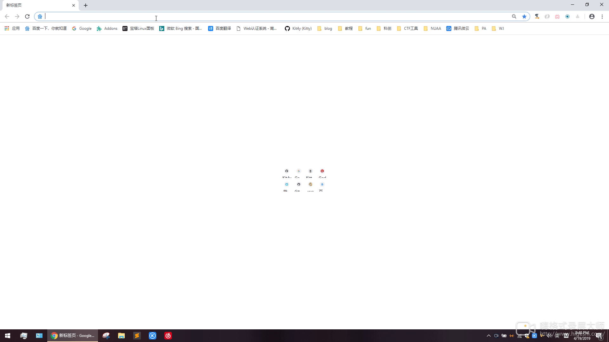
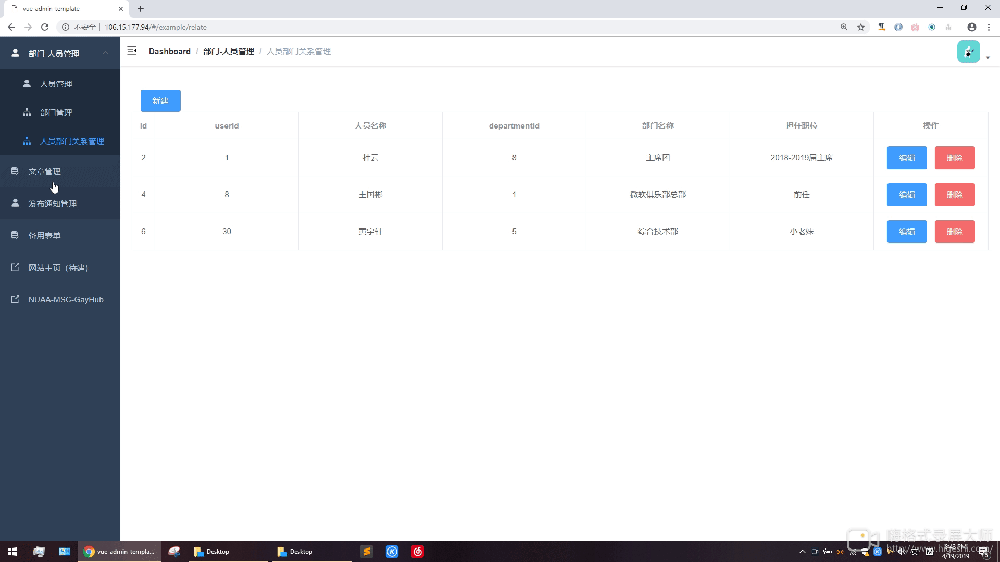

# 南京航空航天大学

## 《软件设计模式与体系结构课程设计报告》报告

* 姓名：刘志赞
* 班级：1617304
* 学号：161730123
* 完成日期：2019.4.18日

### 目录

[TOC]
## 一、课程设计应用概述
### 1、系统描述
本项目名称为“轩辕”、为南航微软俱乐部未来的部门管理系统，提供包括人员、子部门的管理以及文章推送，活动通知等服务，采前后端分离技术，开发的主要方向为尽量提高可拓展性和解除耦合度，力求后期能成为一个通用开源的部门管理SaaS系统以解决各大小部门人员杂乱，通过表格统计人员等痛点

前端代码托管地址: [https://github.com/Kit4y/Nuaa_Msc_ForeEnd_Alpha](https://github.com/Kit4y/Nuaa_Msc_ForeEnd_Alpha)

后端代码托管地址: [https://github.com/Kit4y/Nuaa_MSC_Backend](https://github.com/Kit4y/Nuaa_MSC_Backend)

暂时项目部署地址 [http://106.15.177.94:80](http://106.15.177.94:80) 
### 2、技术栈
系统采用B/S架构，采取前后端分离，主要技术栈为
| 类别 | 选择 |
|-----------------|----------------------|
|前端语言|html+css+js|
|js框架|[Vue](https://cn.vuejs.org/)|
|UI框架|[vue-admin-template](https://github.com/PanJiaChen/vue-admin-template)|
|后端语言|Java|
|Web框架|[springBoot](https://spring.io/projects/spring-boot/)|
|服务器容器|Tomcat|
|数据库服务|Mysql|
|orm持久层框架|[MyBatis](http://www.mybatis.org/mybatis-3/zh/index.html)|
|前后端分离文档处理|[swagger](https://swagger.io/)|
|权限系统|[shiro](http://shiro.apache.org/)|
|版本控制系统|[git](https://git-scm.com)|
|集成开发环境|[Intellij IDEA](https://www.jetbrains.com/idea/)|
|服务器服务|阿里云|
|文档描述语言|markdown|

### 3、系统主要业务逻辑
* ### 人员管理
包括所有人员的增加，删除，修改，查询，登录
* ### 部门管理
包括所有部门的增加，删除，修改，查询，以及人员-部门多对多的管理
* ### 发布技术推送管理
包括所有人员的增加，删除，修改，查询，富文本编辑和人员的绑定
* ### 活动通知管理
包括所有活动通知的增加，删除，修改，查询，富文本编辑和人员的绑定

## 二、Spring框架特点和设计模式分析
### 1、系统配置方法
springboot在springmvc的基础上，全部整改为基于config的形式进行配置，基本回避了spring框架传统的基于xml配置的方法，更加灵活便捷，基于config的特点在于可以充分利用注解进行bean的定义，对象的注入，通过传参、实例化等多种形式实现bean的构造，通过Springboot的配置总结为可以进行一定程度的解耦，获取更主动执行的能力，可以提高系统的可维护性实现封装。
### 2、Spring框架与核心概念理解
#### 2.1、主要架构
开源、社区活跃、大量应用,使得spring的功能覆盖逐渐趋于全面，最新版中已有20多个模块，每个版本的发布都会带来许多优秀的特性。
基本可以归为6种模块分类: spring核心容器、 Web编程、数据访问、AOP编程、 测试业务、Instrumentation。
其核心模块主要包括: Spring Core. Spring Context. Spring Web、Spring Web MVC、Spring Dao、Spring ORM.而其他模块则或多或少会对一些其他框架进行集成，使得轻量级的框架spring仍然可以很便捷地完成各类业务。
#### 2.2、核心概念
spring的核心概念主要在于spring比较早地引入了依赖注入与面向切面编程的特性。有专门为此研究写过博客 [https://kit4y.github.io/2019/02/27/Spring三大思想/](https://kit4y.github.io/2019/02/27/Spring三大思想/)
* ### **依赖注入**

传统java对象的构造方式为new一个类的实例，从而获得该类的一个对象，这种直接面向编码者的构造方式大量地存在程序的编码过程中，而依赖注入作为一种设计模式，则将对象的构造方式对编码者隐藏，只需要按照规范编写类的构造函数或是setter方法，该类就初步具备了被注入的基础。

此时，只需在需要注入的类或接口上加上注入类的注解，就可以跳过对象的构造过程。依赖注入实现了控制反转，利用注解，不再由编码者直接指定接口或是抽象类的实现类，而是由系统主动的判断具体使用哪种实现方式，一方面可以实现各个工作组件间的松耦合，更加灵活地组织功能组件，另一-方面可以减轻编码的工作量。

依赖注入的背后是由spring提供的套完整的工作流程，  包括bean工厂的初始化、各个bean的创建心这个过程也是链式的，如同一个真正的工厂,部件一次装配进生产线中，最终产出业务。
* ### **AOP(面向切面编程)**

AOP（Aspect Oriented Programming）意为：面向切面编程，通过预编译方式和运行期动态代理实现程序功能的统一维护的一种技术。AOP是OOP的延续，是软件开发中的一个热点，也是Spring框架中的一个重要内容（Spring核心之一），是函数式编程的一种衍生范型。利用AOP可以对业务逻辑的各个部分进行隔离，从而使得业务逻辑各部分之间的耦合度降低，提高程序的可重用性，同时提高了开发的效率。

### 3、MVC在本项目中的体现

MVC全名是Model View Controller，是模型(model)－视图(view)－控制器(controller)的缩写，M是指业务模型，V是指用户界面，C则是控制器

1) 模型是用于封装数据的载体，其本质是一个普通的Java Bean，包含一系列的成员变量及其getter/setter方法，本项目中所有的bean实体类比如User,Department,Notification等都是model；

2) 视图而言，更加偏重于展现，在Java中可通过JSP来充当视图，或通过纯HTML进行展现，而本项目采用前后端分离，所以个人认为视图主要指前端js部分；

3) 控制器通常控制器负责从视图读取数据，控制用户输入，并向模型发送数据。在本项目中主要体现在controller的路由分发，Mapper执行ORM,service对模型的处理

## 三、其他设计模式在本项目中的体现

### 1、桥梁模式
桥梁模式的用意是“将抽象化(Abstraction)与实现化(Implementation)脱耦，使得二者可以独立地变化”。在本项目中，所有的service先预设置好接口，然后再写对应的实现，提高了拓展性并且相对解除了耦合度

### 2、工厂模式
最初的spring便提供了BeanFactory及通过工厂完成对象的建立，在web容器启动时候，spring会对配置为Component注解类扫描，通过工厂方法注入，比如在我们的UserService中需要用到orm即UserMapper，这个时候需要从工厂中注入一个UserMapper

### 3、单例和原型模式
由spring工厂创建的对象在spring中默认是单例的，其他类用过使用@Autowired或者@Resource等注解将这些Bean实例注入到对应的成员中，而不是new新的对象。

### 4、模板方法模式
假设前后端不分离，JDBCtemplate使用的最典型的就是模板方法，当然前后端分离中，前端的Vue框架中大量的样板代码对开发者隐藏，只留下需要渲染的少部门类似api的地方供开发者灵活修改，简化编程过程同时又增强了处理能力
### 5、观察者模式
虽然前后端分离，但是中心思想还是mvc框架，实现了多个视图可以使用一个模型进行渲染这也是观察者模式的基础，比如部门的视图，部门人员的视图，通知，文章等的视图，随着人员这个模型的变动其他视图由于加载了这个模型都会随之改变。

## 四、基本功能展示
### 登录登出功能

### 用户管理和部门单独管理

### 用户和部门的多对多关系管理

### 发表的推送管理

### 活动通知管理

